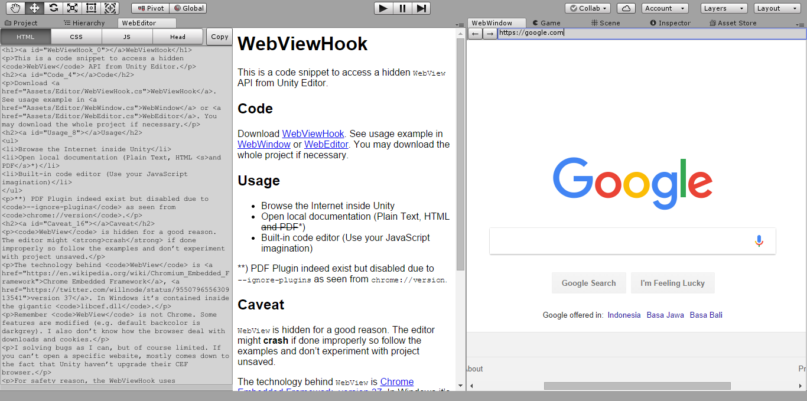

# WebViewHook

This is a code snippet to access a hidden `WebView` API from Unity Editor, and load it to `EditorWindow`.



## Code

Download [WebViewHook](Assets/Editor/WebViewHook.cs). See usage example in [WebWindow](Assets/Editor/WebWindow.cs) or [WebEditor](Assets/Editor/WebEditor.cs). You may download the whole project if necessary.

## Usage

Minimum code to get WebView working:

```c#
class WebViewDemo : EditorWindow
{

    WebViewHook webView;

    void OnEnable()
    {
        if (!webView)
        {
            // create webView
            webView = CreateInstance<WebViewHook>();
        }
    }

    public void OnBecameInvisible()
    {
        if (webView)
        {
            // signal the browser to unhook
            webView.Detach();
        }
    }

    void OnDestroy()
    {
        //Destroy web view
        DestroyImmediate(webView);
    }

    void OnGUI()
    {
        // hook to this window
        if (webView.Hook(this))
            // do the first thing to do
            webView.LoadURL("https://google.com");

        if (ev.type == EventType.Repaint)
        {
            // keep the browser aware with resize
            webView.OnGUI(new Rect(Vector2.zero, this.position.size));
        }
    }
}
```

## Two Way Communication

Using `LoadURL`, `LoadHTML` and `ExecuteJavascript` you only can send information to WebView.

To extract informations from WebView you need external communication, and the easiest way to do this is by using [Web Socket](https://developer.mozilla.org/en-US/docs/Web/API/WebSockets_API).

To get web socket server running you need to download [WebSocket-Sharp](https://github.com/sta/websocket-sharp) and a [script utility from this repo](Assets/Editor/WebSocketHook.cs).

See [WebData](Assets/Editor/WebData.cs) for minimal working example of using `WebSocketHook` to hook C# into javascript variable.

## Caveat

`WebView` is hidden for a good reason. The editor might **crash** if done improperly so follow the examples and don't experiment with project unsaved.

The technology behind `WebView` is [Chrome Embedded Framework](https://en.wikipedia.org/wiki/Chromium_Embedded_Framework), [version 37](https://twitter.com/willnode/status/955079655630913541). In Windows it's contained inside the gigantic `libcef.dll`.

`WebView` in Unity is just like Chrome, with background-color default to darkgrey and no plugins allowed (hence you can't open Flash/Java/PDF inside it).

I solving bugs as I can, but of course limited. If you can't open a specific website, mostly comes down to the fact that Unity haven't upgrade their CEF browser.

For safety reason, the WebViewHook uses `AssemblyReloadEvents` which only available in Unity version 2017.1 or higher.